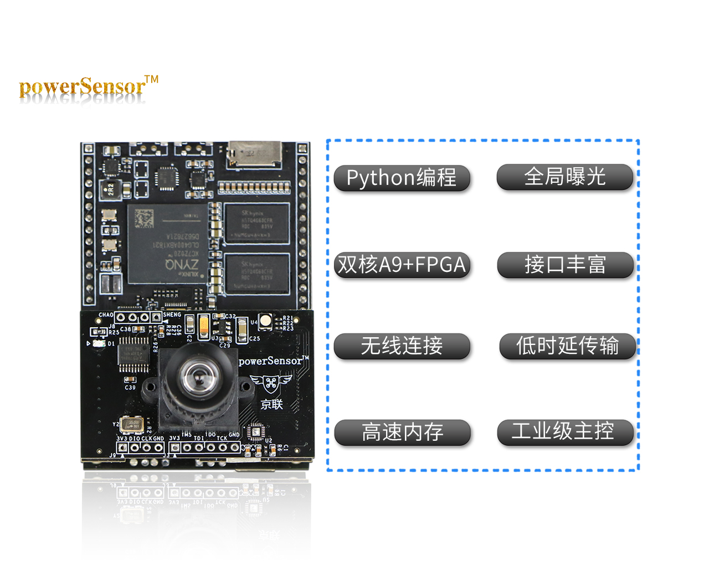

# powerSensor_workspace

#### 介绍
powersensor 传感器的日常工作目录，主要包含ipython、python例程。

这里的例程更新的速度与博客里面的教程同步，会相对较快，pdf的教程大概1个季度更新一版。

## 主要内容

1. 最最基本的教程：[cameraTutorial0_baisc.ipynb](https://github.com/powersensor-cn/powerSensor_workspace/blob/master/cameraTutorial0_baisc.ipynb)
2. Tutorial 第一部分例程，对应pdf板教程V1.0的tutorial部分的1-5讲：[cameraTutorial_basic_part1.ipynb](https://github.com/powersensor-cn/powerSensor_workspace/blob/master/cameraTutorial_basic_part1.ipynb)
   1. 在图像上左标记
   2. 图像预处理1：常用转换
   3. 图像预处理2：平滑滤波
   4. 图像预处理3：形态学处理
   5. 图像的特征1：直方图及其均衡化
3. Tutorial 第二部分例程，对应pdf板教程V1.0的tutorial部分的6-10讲[cameraTutorial_basic_part2.ipynb](https://github.com/powersensor-cn/powerSensor_workspace/blob/master/cameraTutorial_basic_part2.ipynb)
   1. 图像的特征2：梯度特征（边缘特征）
   2. 图像的特征3：频域特征（傅里叶变换）
   3. 图像的二值化与边缘检测
   4. 常见的形状检测
   5. 动态图像处理（帧差分）
4. Demo第一部分例程，对应pdf板教程V1.0的demo部分[cameraTutorial_demo_part1.ipynb](https://github.com/powersensor-cn/powerSensor_workspace/blob/master/cameraTutorial_demo_part1.ipynb)
   1. 二维码识别、AprilTag识别
   2. 人脸识别

## 其他文件说明

1. [haarcascade_eye.xml](https://github.com/powersensor-cn/powerSensor_workspace/blob/master/haarcascade_eye.xml)、[haarcascade_frontalcatface.xml](https://github.com/powersensor-cn/powerSensor_workspace/blob/master/haarcascade_frontalcatface.xml)、[haarcascade_frontalface_alt.xml](https://github.com/powersensor-cn/powerSensor_workspace/blob/master/haarcascade_frontalface_alt.xml) 是人脸、猫脸检测的模板文件
2. [offline.py](https://github.com/powersensor-cn/powerSensor_workspace/blob/master/offline.py) 是offline模式时运行的文件

## 有用的网址

- 论坛，有问题请在这里提问（也会有最新版本的pdf教程）：http://bbs.jingliankeji.com/forum.php?gid=56
- 博客，这里会发布最新的教程：http://www.jingliankeji.cn/powersensor/
- opencv官方教程，这里可以找到opencv函数正统的解释：https://docs.opencv.org/3.4/